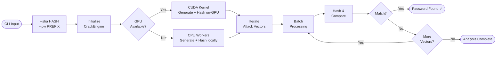

<div align="center">

# SCrack

**High-performance SHA-1 partial password recovery engine**

[](https://www.python.org/)
[](https://github.com/AlGhozaliRamadhan/SCrack/blob/main/LICENSE)
[](https://developer.nvidia.com/cuda-toolkit)
[]()
[]()

*When you know part of the password, SCrack finds the rest.*

</div>

---

## Overview

**SCrack** is a high-performance SHA-1 password cracker built for **partial password recovery**. Given a known prefix and a SHA-1 hash, SCrack brute-forces the unknown suffix using GPU acceleration (CUDA via CuPy) or CPU multiprocessing — whichever is available on your system.

> **Tip:** For long-running analyses, [Google Colab](https://colab.research.google.com/) with a free T4 GPU can dramatically reduce processing time.

---

## Features

| Feature | Description |
|---|---|
| **GPU Acceleration** | Custom CUDA C++ SHA-1 kernel via CuPy — generates & hashes on-GPU |
| **CPU Multiprocessing** | Automatic fallback using all available CPU cores |
| **CLI Interface** | `--sha` and `--pw` flags — no config file editing needed |
| **Smart Attack Vectors** | 7-tier prioritized search patterns, cheapest first |
| **Batched Processing** | Up to 40M candidates/batch on GPU, 100K/batch on CPU |
| **Real-Time Monitoring** | Live progress with rate (ops/sec) and ETA |
| **Early Stopping** | Atomic cross-process flag halts all workers on first match |

---

## Installation

### Local (Windows / Linux / macOS)

```bash
# Clone the repository
git clone https://github.com/AlGhozaliRamadhan/SCrack.git
cd SCrack

# Create a virtual environment (recommended)
python -m venv .venv

# Activate it
# Windows:
.venv\Scripts\activate
# Linux/macOS:
source .venv/bin/activate

# Install dependencies
pip install -r requirements.txt
```

> **Note:** `cupy-cuda12x` requires an NVIDIA GPU with CUDA 12.x drivers.
> If you don't have a GPU, SCrack will automatically fall back to CPU multiprocessing — only `numpy` is required.
>
> **CPU-only install:**
> ```bash
> pip install numpy
> ```

### Google Colab (GPU)

Paste this into a single Colab cell — it clones, installs, and runs in one go.
Just change the `SHA_HASH` and `PASSWORD_PREFIX` values:

```python
# ─── SCrack on Google Colab ─────────────────────────────────────────────
# Change these two values ↓
SHA_HASH        = "1"
PASSWORD_PREFIX = "1"

# Setup & run (no changes needed below)
!git clone https://github.com/AlGhozaliRamadhan/SCrack.git 2>/dev/null; \
  cd SCrack && pip install -q numpy cupy-cuda12x && \
  python main.py --sha {SHA_HASH} --pw {PASSWORD_PREFIX}
```

> Make sure the Colab runtime is set to **GPU** (Runtime → Change runtime type → T4 GPU).

---

## Usage

```bash
python main.py --sha <HASH> --pw <PREFIX>
```

### Examples

```bash
# Crack a hash where the password starts with "fanta"
python main.py --sha f7603d2a230e3af777f71b9d5399078321305431 --pw fanta

# Crack a hash where the password starts with "pass"
python main.py --sha 5baa61e4c9b93f3f0682250b6cf8331b7ee68fd8 --pw pass

# Show help
python main.py --help
```

### Arguments

| Flag | Required | Description |
|------|----------|-------------|
| `--sha` | ✅ | The 40-character hex SHA-1 hash to crack |
| `--pw` | ✅ | Known prefix of the password (the visible part) |
| `--help` | | Show usage information |

---

## Configuration

Performance constants can be tuned in `module/config.py`:

```python
MAX_SEARCH_SPACE  = 100_000_000_000   # Skip vectors larger than this
CPU_BATCH_SIZE    = 100_000           # Candidates per CPU batch
GPU_BATCH_SIZE    = 40_000_000        # Candidates per GPU batch
NUM_CPU_WORKERS   = mp.cpu_count()    # Parallel CPU worker processes
```

> **Performance tip:** Narrowing the charset in `module/attacks.py` reduces the search space significantly. Use the most restrictive set that still covers your expected password.

---

## How It Works

SCrack generates multiple **attack vectors**, each combining the known prefix with candidate suffixes of varying length and character set. Vectors are sorted by priority and estimated cost — shorter, simpler combinations are tried first.



Each attack vector is validated against `MAX_SEARCH_SPACE` before execution — vectors that exceed the limit are automatically skipped to prevent runaway searches.

---

## Example Output

```
======================================================================
SHA-1 CRYPTOGRAPHIC ANALYSIS ENGINE - GPU OPTIMIZED
======================================================================
Target Hash: f7603d2a230e3af777f71b9d5399078321305431
Analysis Prefix: fanta
Maximum Search Space: 100,000,000,000 combinations
Acceleration: CPU (8 cores)
======================================================================

--- Vector 3/31 [Priority: 1] ---
Pattern: fanta + 3 chars from a set of 36
Computational complexity: 46,656

======================================================================
PASSWORD FOUND!
Recovered Plaintext: fanta818
Time to Crack Vector: 0.42 seconds
Total Analysis Time: 0.58 seconds

--- Verification ---
  Target Hash: f7603d2a230e3af777f71b9d5399078321305431
   Found Hash: f7603d2a230e3af777f71b9d5399078321305431
        Match: True
======================================================================

Analysis Status: SUCCESS
```

---

## Requirements

| Dependency | Version | Required | Purpose |
|---|---|---|---|
| Python | 3.8+ | ✅ | Runtime |
| NumPy | Latest | ✅ | Array processing for GPU data |
| CuPy | `cupy-cuda12x` | ❌ Optional | GPU acceleration (NVIDIA CUDA) |

---

## License

This project is licensed under the **MIT License** — see the [LICENSE](https://github.com/AlGhozaliRamadhan/SCrack/blob/main/LICENSE) file for full details.

---

## Disclaimer

> SCrack is intended **strictly** for legitimate use cases including:
> - Authorized security analysis and penetration testing
> - Personal password recovery on hashes you own
> - Educational and research purposes
>
> **Always obtain proper authorization before analyzing any hash value. Unauthorized use against systems or accounts you do not own may violate applicable laws.**
