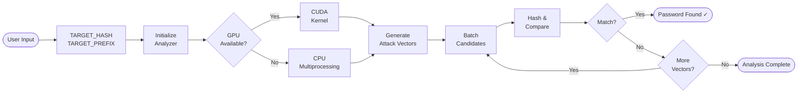

<div align="center">

# SCrack

**High-performance SHA-1 partial password recovery engine**

[](https://www.python.org/)
[](https://github.com/AlGhozaliRamadhan/SCrack/blob/main/LICENSE)
[](https://developer.nvidia.com/cuda-toolkit)
[]()

*When you know part of the password SCrack finds the rest.*

</div>

---

## Overview

**SCrack** a high-performance SHA-1 password cracker built for **partial password recovery**. Given a known prefix, SCrack efficiently brute-forces the unknown suffix using GPU acceleration (CUDA) or CPU multiprocessing whichever is available on your system.

> **Tip:** For long-running analyses, [Google Colab](https://colab.research.google.com/) with a free T4 GPU can dramatically reduce processing time.

---

## Features

| Feature | Description |
|---|---|
| **GPU Acceleration** | CuPy CUDA kernel + PyCUDA fallback for NVIDIA GPUs |
| **CPU Multiprocessing** | Automatic fallback using all available CPU cores |
| **Smart Attack Vectors** | Prioritized search patterns ordered by computational efficiency |
| **Batched Processing** | Configurable batch sizes — up to 40M candidates/batch on GPU |
| **Real-Time Monitoring** | Live progress output with timing and status updates |
| **Configurable Search Space** | Set hard limits on maximum combinations to attempt |

---

## GPU Acceleration

SCrack has a custom CUDA C++ kernel compiled via CuPy, so SHA-1 hashing runs directly on the GPU in parallel. If CuPy isn't available, it falls back to PyCUDA, and if there's no GPU at all, it drops back to CPU multiprocessing across all available cores. GPU mode handles up to 40 million candidates per batch.

---

## Usage

### 1. Configure Target

Open `crack.py` and set your target hash and known prefix:

```python
TARGET_HASH   = "f7603d2a230e3af777f71b9d5399078321305431"
TARGET_PREFIX = "fanta"
```

### 2. Run the Analyzer

```bash
python main.py
```

---

## Configuration

### Core Settings

```python
MAX_SEARCH_SPACE = 100_000_000_000   # Maximum combinations to attempt
BATCH_SIZE       = 100_000           # Candidates per processing batch
NUM_WORKERS      = mp.cpu_count()    # CPU cores for parallel processing
```

### Character Sets

Customize the character set to match your expected password pattern:

```python
import string

# Numeric only
charset = string.digits

# Lowercase alphanumeric
charset = string.ascii_lowercase + string.digits

# Full alphanumeric
charset = string.ascii_letters + string.digits

# Full character set (with symbols)
charset = string.ascii_letters + string.digits + "!@#$%^&*"
```

> **Performance tip:** Narrowing the charset reduces the search space significantly. Use the most restrictive set that still covers your expected password.

---

## How It Works

SCrack generates multiple **attack vectors**, each combining the known prefix with candidate suffixes of varying length and character set. Vectors are sorted by estimated computational cost — shorter, simpler combinations are tried first.



Each attack vector is validated against `MAX_SEARCH_SPACE` before execution — vectors that exceed the limit are automatically skipped to prevent runaway searches.

---

## Example Output

```
━━━━━━━━━━━━━━━━━━━━━━━━━━━━━━━━━━━━━━━━━━━━━
  PASSWORD FOUND: ca95818
  Time taken: 0.00 seconds
━━━━━━━━━━━━━━━━━━━━━━━━━━━━━━━━━━━━━━━━━━━━━

  Verification:
    Target  : 73267e648d4278b29e8c99948393e146dfd60aae
    Found   : 73267e648d4278b29e8c99948393e146dfd60aae
    Match   : ✓ True

  Analysis Status: SUCCESS
━━━━━━━━━━━━━━━━━━━━━━━━━━━━━━━━━━━━━━━━━━━━━
```

---

## Requirements

| Dependency | Version | Purpose |
|---|---|---|
| Python | 3.7+ | Runtime |
| NumPy | Latest | Array processing |
| CuPy | Optional | GPU acceleration (primary) |
| PyCUDA | Optional | GPU acceleration (fallback) |

Install all required dependencies:

```bash
pip install -r requirements.txt
```

---

## License

This project is licensed under the **MIT License** see the [LICENSE](https://github.com/AlGhozaliRamadhan/SCrack/blob/main/LICENSE) file for full details.

---

## Disclaimer

> SCrack is intended **strictly** for legitimate use cases including:
> - Authorized security analysis and penetration testing
> - Personal password recovery on hashes you own
> - Educational and research purposes
>
> **Always obtain proper authorization before analyzing any hash value. Unauthorized use against systems or accounts you do not own may violate applicable laws.**
